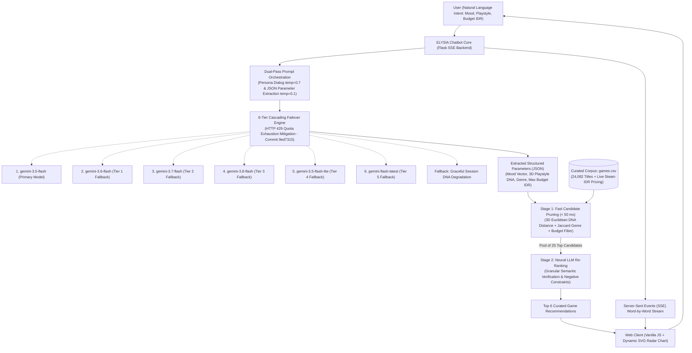

# ELYSIA — Emotionally-adjusted Ludic Yield Spatial Integrated Assistant
### Conversational Video Game Recommendation Assistant Powered by Large Language Models (LLM) & Psychographic Playstyle DNA

[](https://elysia-video-game-recommendation.onrender.com/)
[](#)
[](https://aistudio.google.com/)
[](#)
[](#)

ELYSIA is an intelligent conversational assistant engineered to deliver personalized video game recommendations through natural, empathetic, and structured dialogue. Unlike conventional storefront recommendation engines that rely on static keyword searches and rigid demographic buckets, ELYSIA leverages a **Two-Stage Hybrid Retrieval Pipeline** combining **3D Psychographic Playstyle DNA**, **Jaccard Genre Similarity**, and **Neural LLM Re-Ranking** via Google Gemini to accommodate contextual mood shifts and negative user constraints in real time.

---

## Table of Contents
1. [Core Concept & Assistant Philosophy](#core-concept--assistant-philosophy)
2. [System Specifications & Key Features](#system-specifications--key-features)
3. [User Interface (UI/UX) & Modern Interactivity](#user-interface-uiux--modern-interactivity)
   - [1. Aesthetic Philosophy & Color Palette](#1-aesthetic-philosophy--color-palette)
   - [2. UI/UX Technology Stack](#2-uiux-technology-stack)
4. [System Architecture & Computational Flow](#system-architecture--computational-flow)
   - [Two-Stage Retrieval & Re-Ranking Pipeline](#two-stage-retrieval--re-ranking-pipeline)
5. [Quantitative Benchmarks & System Metrics](#quantitative-benchmarks--system-metrics)
6. [Cloud Deployment (Render Web Service)](#cloud-deployment-render-web-service)
7. [Repository Structure](#repository-structure)
8. [Step-by-Step Execution Guide](#step-by-step-execution-guide)
   - [A. Live Cloud Web Application](#a-live-cloud-web-application)
   - [B. Interactive Notebook Environment (Jupyter / VS Code)](#b-interactive-notebook-environment-jupyter--vs-code)
   - [C. Terminal CLI Chatbot](#c-terminal-cli-chatbot)
   - [D. Local Fullstack Flask Web Server](#d-local-fullstack-flask-web-server)
9. [Sample Conversation Showcase](#sample-conversation-showcase)
10. [Codebase Module Reference](#codebase-module-reference)
11. [License & Attributions](#license--attributions)

---

## Core Concept & Assistant Philosophy

Traditional recommender systems often suffer from the "cold start" paradox and semantic blindness: they treat gaming preferences as static tags and fail to capture momentary fatigue, emotional state, or nuanced negative constraints (e.g., *"I want an intense action title, but strictly without sword combat or gothic horror"*).

ELYSIA bridges this gap through a high-availability conversational interface governed by three pillars:
* **Empathetic & Polished Persona**: ELYSIA interacts with an articulate, thoughtful, and serene tone, deliberately avoiding generic AI platitudes and emojis to maintain an elegant editorial reading experience.
* **Psychographic Playstyle DNA (3D Spatiotemporal Vector)**: Quantifies player gaming orientation along three orthogonal continuous axes:
  * $	ext{Casual} \longleftrightarrow 	ext{Hardcore}$
  * $	ext{Simple} \longleftrightarrow 	ext{Complex}$
  * $	ext{Calming} \longleftrightarrow 	ext{Adrenaline}$
* **High-Availability Cascading Multi-Model Resilience**: Engineered with an automated 6-tier fallback circuit breaker across Google Gemini model variants to safeguard against HTTP 429 API rate limits without disrupting user sessions.

---

## System Specifications & Key Features

| Capability / Module | Technical Implementation & Architecture |
| :--- | :--- |
| **Conversational Core** | Built on Google Gemini Flash API with custom System Prompt personas enforcing warm, polite, and emoji-free conversational boundaries. |
| **Cascading Failover Engine** | Automated sequential failover across 6 Gemini model tiers (`gemini-3.5-flash` primary) to eliminate downtime from cloud quota limits (`Commit 9ed7315`). |
| **Real-Time Streaming Pipeline** | Delivers word-by-word token streaming via native Python generators in terminal/notebook modes and **Server-Sent Events (SSE)** over HTTP in web interfaces. |
| **Deterministic Entity Extraction** | Dual-pass structured prompting (`temperature=0.1`) extracting JSON payloads: user mood vectors, genres, budget constraints (IDR), and 3D DNA coordinates. |
| **Session Persistence Management** | Full session state serialization allowing users to export timestamped chat logs to JSON and restore past conversation sessions on demand. |
| **Hybrid Recommendation Engine** | Combines 3D Euclidean DNA distance, Jaccard genre similarity, Metacritic/RAWG scores, and real-time Steam IDR budget filtering across **24,082 titles**. |
| **Neural LLM Re-Ranking** | Overcomes macro-genre semantic ambiguity by passing Stage 1 candidates to Gemini for deep semantic verification against negative constraints before presenting the Top 6 curated titles. |

---

## User Interface (UI/UX) & Modern Interactivity

The frontend is crafted to offer an immersive, calm, and editorial reading atmosphere, merging publication-grade aesthetics with modern web engineering (*Pure Vanilla Stack*).

### 1. Aesthetic Philosophy & Color Palette
* **Warm Editorial Parchment**: Features a comforting `#FAF7F2` warm parchment backdrop paired with the minimalism of modern AI dialogue layouts.
* **Curated Palette**:
  - `Background Parchment`: `#FAF7F2` and `#FFFFFF` (reduces eye strain during prolonged reading).
  - `Text & Ink Accents`: `#1E1B18` (midnight ink) and `#5A524C` (charcoal muted).
  - `Brand & Dynamic Accents`: `#C97A63` (terracotta blush) and `#7E9A94` (sage mist).
* **Contrasting Typography**: Blends editorial serif typography (*Playfair Display*) for titles and headings with geometric sans-serif (*Plus Jakarta Sans*) for optimal chat readability.

### 2. UI/UX Technology Stack
* **Semantic HTML5**: Clean, accessible layout separating conversation history, slide-over drawer, and modal dialogs.
* **Modern Vanilla CSS3**:
  - Centralized design tokens/CSS variables for spacing, color harmonies, and border radii.
  - Subtle glassmorphism (`backdrop-filter: blur()`) on topbars and floating control decks.
  - Smooth micro-interactions: slide-up transitions, hover elevations, and pulsing thinking indicators.
  - Fully responsive layout adapting from mobile screens to ultrawide desktop monitors.
* **Vanilla JavaScript (ES6+)**:
  - **Native SSE Streaming Parser**: Consumes `text/event-stream` using the browser's built-in `ReadableStream`, providing latency-free rendering.
  - **Dynamic 3D Playstyle DNA SVG Radar Chart**: Client-side mathematical polygon calculation rendering 3D playstyle radar visualizers directly on recommendation cards without external charting libraries.
  - **Utility Tooling**: One-click message copying with non-intrusive toast notifications and instant response regeneration.
  - **Slide-Over History Drawer**: Seamless drawer interface to manage, inspect, export, or purge conversation sessions.

---

## System Architecture & Computational Flow



### Two-Stage Retrieval & Re-Ranking Pipeline
1. **Stage 1 — Candidate Generation (Fast Mathematical Pruning)**:
   The backend scans the 24,082-title dataset using vectorized NumPy/Pandas operations in **< 50 milliseconds**. Filters evaluate 3D Euclidean Playstyle distance, Jaccard genre intersection, normalized RAWG/Metacritic ratings, and regional Steam IDR budget constraints to produce a candidate pool of **25 top titles**.
2. **Stage 2 — Neural Re-Ranking (Contextual & Negative Constraint Enforcement)**:
   The 25 candidate vectors are evaluated by Google Gemini acting as a *Neural Re-Ranker*. The LLM inspects conversational context for subtle nuances (e.g., specific weapon mechanics, pacing preferences, or negative constraints like *"no jump scares"* or *"no sword combat"*), pruning contradictions and selecting the final **Top 6 high-precision recommendations**.

---

## ⚡ Quantitative Benchmarks & System Metrics

The following metrics reflect measured benchmarks across ELYSIA's production architecture:

| Evaluation Parameter | Measured Benchmark | Engineering Methodology & Architecture |
| :--- | :---: | :--- |
| **Stage 1 Pruning Latency** | **&lt; 50 ms** | Vectorized 3D Euclidean coordinate distance & Jaccard similarity on NumPy matrices |
| **Indexed Catalog Scale** | **24,082 Titles** | Clean dataset mapped with live Indonesian Rupiah (IDR) Steam storefront pricing |
| **Cloud Failover Depth** | **6 Sequential Tiers** | Cascading fallback circuit breaker across Gemini variants mitigating HTTP 429s (`Commit 9ed7315`) |
| **Response Delivery Protocol** | **Server-Sent Events (SSE)** | Zero-dependency word-by-word token delivery via Flask event stream generators |
| **Perceptual Client Latency** | **Instantaneous (&lt; 100 ms)** | Real-time streaming via ES6 `ReadableStream` parser eliminating perceived wait times |
| **Playstyle Profiling** | **3D DNA / 6-Axis Radar** | Client-side mathematical SVG polygon rendering without external charting libraries |

---

## Deployment Cloud (Render Web Service)

ELYSIA is deployed and publicly accessible as a continuous cloud **Web Service** on **Render**.

> 🌐 **Live Cloud Application**: [https://elysia-video-game-recommendation.onrender.com/](https://elysia-video-game-recommendation.onrender.com/)

### Cloud Architecture Specifications
| Parameter | Configuration & Implementation |
| :--- | :--- |
| **Platform Provider** | [Render.com](https://render.com/) (Fully Managed Cloud Application Platform) |
| **Service Model** | **Web Service** (Serves Flask RESTful API, SSE streams, and static assets) |
| **Geographic Region** | **Singapore** (Minimizes network latency for Southeast Asian users) |
| **Runtime Environment** | **Python 3** (Linux container) |
| **Build Command** | `pip install -r requirements.txt` |
| **Start Command** | `python backend/app.py` |
| **Host & Port Binding** | Dynamically binds to `0.0.0.0` and maps Render's dynamic `$PORT` environment variable |
| **Secrets Management** | `GEMINI_API_KEY` stored encrypted in Render Environment Secrets, protected from public exposure |
| **Continuous Deployment** | Automated deployment triggered on every push to the `main` GitHub branch |
| **Resource Optimization** | Energy-efficient automatic spin-down after 15 minutes of user inactivity |

---

## Repository Structure

```text
conversational-video-game-recommendation-assistant/
├── backend/                              # Backend Server & Recommendation Engines
│   ├── app.py                            # Flask REST API, SSE streaming & static asset server
│   ├── chatbot.py                        # Gemini API wrapper, CLI session loop & history manager
│   ├── config.py                         # Model configurations, LLM parameters & env loader
│   └── recommendation_algorithm.py       # 3D Playstyle DNA engine, mood modifiers & distance scoring
│
├── frontend/                             # Web Client Interface
│   ├── app.js                            # Client-side state, SSE reader, markdown parser & modals
│   ├── index.html                        # Semantic chat structure & slide-over history drawer
│   └── style.css                         # Editorial theme design (warm parchment & clean typography)
│
├── notebooks/                            # Research & Experimental Validation
│   └── chatbot_notebook.ipynb            # Interactive notebook, prompt evaluation & dialog transcripts
│
├── data/                                 # Curated Corpora
│   └── games.csv                         # 24,082 titles with RAWG metadata & Steam IDR prices
│
├── screenshots/                          # Visual Documentation & Empirical Logs
│   ├── Chat Notebook.md                  # Complete multi-turn dialog transcript from notebook run
│   ├── Hasil Percobaan Notebook.png      # High-resolution screenshot of notebook dialog
│   └── Chatbot Website.md                # UI screenshots & interactive web application showcase
│
├── .env.example                          # Environment variable configuration template
├── .gitignore                            # Standard git ignore definitions
├── requirements.txt                      # Python dependencies manifest
└── README.md                             # Project technical documentation
```

---

## Step-by-Step Execution Guide

### Prerequisites
- **Python 3.10+** installed on your system.
- An active **Google Gemini API Key** (obtainable via [Google AI Studio](https://aistudio.google.com/)).

---

### A. Live Cloud Web Application

The fastest way to experience ELYSIA without local installation:

1. Navigate to: [https://elysia-video-game-recommendation.onrender.com/](https://elysia-video-game-recommendation.onrender.com/)
2. Start chatting by describing your preferred mood, mechanics, or gaming background.
3. Click the **Recommend Games** button or type recommendation keywords to trigger the Two-Stage engine.

> *Note: If the instance is idling, initial cold-start spin-up may take approximately 30–50 seconds.*

---

### B. Interactive Notebook Environment (Jupyter / VS Code)

1. Open [notebooks/chatbot_notebook.ipynb](notebooks/chatbot_notebook.ipynb).
2. Set your active Python kernel to your configured virtual environment.
3. Execute cells sequentially:
   - Dependency imports and `.env` credentials loading.
   - Initializing `gemini-3.5-flash` with the ELYSIA System Prompt persona.
   - Testing real-time token streaming generators.
   - Loading the dataset and computing baseline 3D Playstyle DNA tensors.
   - Executing `jalankan_elysia_interactive()` for full inline interactive multi-turn dialogue.

---

### C. Terminal CLI Chatbot

1. **Clone the repository:**
   ```bash
   git clone https://github.com/Bejochan/conversational-video-game-recommendation-assistant.git
   cd conversational-video-game-recommendation-assistant
   ```

2. **Create and activate a virtual environment:**
   - **Windows:**
     ```powershell
     python -m venv .venv
     .venv\Scripts\activate
     ```
   - **macOS / Linux:**
     ```bash
     python3 -m venv .venv
     source .venv/bin/activate
     ```

3. **Install dependencies:**
   ```bash
   pip install -r requirements.txt
   ```

4. **Configure environment variables:**
   Copy the `.env.example` template:
   ```bash
   cp .env.example .env
   ```
   Edit `.env` and add your API credentials:
   ```env
   GEMINI_API_KEY=AIzaSy_your_gemini_api_key_here
   ```

5. **Launch the CLI assistant:**
   ```bash
   python backend/chatbot.py
   ```
   *Terminal Commands:*
   - `exit`: Terminate the current session.
   - `clear`: Clear conversational memory.
   - `save`: Export session transcript to a timestamped JSON file.
   - `recommend`: Analyze conversation context and generate instant game recommendation cards.

---

### D. Local Fullstack Flask Web Server

1. Ensure dependencies are installed and `.env` credentials are configured.
2. Launch the Flask application:
   ```bash
   python backend/app.py
   ```
3. Open your browser and navigate to:
   ```text
   http://127.0.0.1:5000
   ```
   The Flask server automatically serves backend endpoints and static frontend assets (`index.html`, `style.css`, `app.js`).

---

## Sample Conversation Showcase

Real-world multi-turn conversational transcript from an empirical test session in [notebooks/chatbot_notebook.ipynb](notebooks/chatbot_notebook.ipynb):

```text
=================================================================
       ELYSIA - Video Game Recommendation Assistant
=================================================================

User   : Good evening Elysia, I'm looking for an adrenaline-pumping 
         game that still features charming and cute characters.

ELYSIA : Good evening. It is a pleasure to welcome you tonight. 

         That is a wonderful contrast. Craving heart-pounding adrenaline 
         while being accompanied by endearing art and charming characters 
         creates a memorable and captivating gaming experience.

         A few titles come to mind immediately. For instance, have you 
         explored Cult of the Lamb? You lead a charming woodland cult as 
         an adorable lamb, interspersed with fast-paced, high-stakes dungeon 
         crusades. Or perhaps you would enjoy the hand-drawn boss rushes of Cuphead?

         Before we narrow our search, would you prefer a solo journey or 
         a multiplayer adventure? And what budget range on Steam are we working with?

User   : Solo only please, I'm an introvert, and my budget is under IDR 200,000.

ELYSIA : A very wise choice. Immersing oneself in a focused solo adventure 
         is often the finest way to recharge. 

         Under IDR 200,000, Steam provides exceptional options:
         1. Cuphead (~Rp 115,000)
         2. Hollow Knight (~Rp 125,000)
         3. Enter the Gungeon (~Rp 115,000)

User   : recommend

[System] Analyzing dialogue context and extracting constraints...
ELYSIA : Welcome back. Here are your personalized game recommendations, 
         carefully filtered within your IDR 200,000 budget:

         1. SUPERHOT VR (Compatibility Match: 84.2%)
            * Price: Rp 63,999 (60% Discount)
            * Genres: Action, Shooter, Simulation, Indie
         2. Blood (Compatibility Match: 84.1%)
            * Price: Free to Play
            * Genres: Action, Shooter, Simulation, Indie
         3. AirMech Wastelands (Compatibility Match: 83.1%)
            * Price: Rp 95,999
            * Genres: Action, RPG, Strategy, Indie
         4. The Chronicles Of Myrtana: Archolos (Compatibility Match: 83.0%)
            * Price: Free to Play
            * Genres: Action, RPG, Indie
         5. The Last Spell (Compatibility Match: 83.0%)
            * Price: Rp 62,099 (70% Discount)
            * Genres: Action, RPG, Strategy, Indie

User   : exit

ELYSIA : Thank you for conversing with me. May your upcoming gaming journeys be delightful!
```

---

## Codebase Module Reference

1. **`backend/config.py`**:
   - Manages secure environment variable loading via `python-dotenv` (`override=True`).
   - Configures the primary LLM model (`gemini-3.5-flash`) and automated cascading fallback priority list (`gemini-3.6-flash`, `gemini-3.7-flash`, `gemini-3.8-flash`, `gemini-3.5-flash-lite`, `gemini-flash-latest`).
   - Handles dynamic network binding (`HOST = 0.0.0.0` and `$PORT` resolution) for seamless deployment on Render.

2. **`backend/recommendation_algorithm.py`**:
   - Ingests the 24,082-row catalog with localized Steam IDR pricing.
   - Pre-computes normalized 3D Playstyle DNA vectors (`dna_hardcore`, `dna_complex`, `dna_adrenaline`).
   - Implements `apply_mood_modifier()` for dynamic vector modulation.
   - Computes weighted composite similarity scores (3D Euclidean distance, Jaccard genre similarity, Metacritic/RAWG rating normalization, and budget constraints).

3. **`backend/chatbot.py`**:
   - Initializes Google Gemini `GenerativeModel` instances with the ELYSIA System Prompt persona.
   - Orchestrates multi-turn conversation state and session memory.
   - Implements interactive CLI loops and JSON export capabilities.
   - Houses the **Two-Stage Re-Ranking** module (`rerank_recommendations()`): leverages Gemini's semantic comprehension to validate Stage 1 candidates against negative user constraints before returning the final Top 6 titles.

4. **`backend/app.py`**:
   - Flask RESTful server powering client endpoints:
     - `POST /api/chat`: Real-time streaming conversation endpoint via Server-Sent Events (SSE).
     - `POST /api/recommend`: Two-Stage Retrieval endpoint generating mathematically pruned and LLM re-ranked recommendations.
     - `GET /api/session/history` & `POST /api/session/load`: Session state management.
   - Serves frontend static assets in both local development and cloud production environments.

5. **`frontend/` (`index.html`, `style.css`, `app.js`)**:
   - **Pure Vanilla Web Architecture**: Built purely with Semantic HTML5, Modern CSS3, and Vanilla JavaScript ES6+ without heavy external framework overhead.
   - **Warm Editorial Aesthetic**: Features a `#FAF7F2` warm parchment backdrop, `#C97A63` terracotta accents, and elegant serif-sans typography.
   - **Real-Time Streaming**: Native `ReadableStream` reader parsing SSE events with an embedded Markdown renderer.
   - **Interactive Tooling**: Clipboard copy utilities, response regeneration, and dynamic SVG radar charts rendering 3D playstyle profiles.
   - **Slide-Over History Drawer**: Smooth lateral drawer interface for managing, loading, and inspecting past chat sessions.

---

## 📜 License & Attributions

* **Large Language Model (LLM) Architecture:** [Google Gemini Flash API](https://aistudio.google.com/)
* **Video Game Metadata Corpus:** [RAWG Video Games Database API](https://rawg.io/apidocs)
* **Market Pricing & Storefront Data:** [Steam Community & Store Data](https://store.steampowered.com/)
* **Cloud Hosting Infrastructure:** [Render Cloud Platform](https://render.com/)
